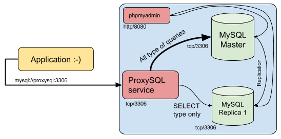

## MySQL master/slave example + using ProxySQL service as MySQL Balancer

Build status:

[](https://travis-ci.org/Onix-Systems/mysql-master-slave)

---

### Requirements

1. docker-engine
1. docker-compose (that supports docker-compose.yml file of version 3)

---

### Usage
```
$ docker-compose build
$ docker-compose up -d
$ docker-compose ps
            Name                          Command               State            Ports          
-----------------------------------------------------------------------------------------------
mysqlhighload_configurator_1   docker-entrypoint.sh /conf ...   Exit 0                          
mysqlhighload_master_1         docker-entrypoint.sh --cha ...   Up       3306/tcp               
mysqlhighload_phpmyadmin_1     /run.sh phpmyadmin               Up       0.0.0.0:8080->80/tcp   
mysqlhighload_proxysql_1       /entrypoint.sh proxysql -c ...   Up       0.0.0.0:3306->6033/tcp
mysqlhighload_slave_1          docker-entrypoint.sh --cha ...   Up       3306/tcp         
```

After successfully deployment, user can open phpmyadmin to check connectivity
with master and slave MySQL servers.

phpmyadmin is accessible by url: http://localhost:8080/

---

### Project scheme



---

### Running tests

Tests items:

* Creating test table on master servers
* Instert new record in previously created table
* Testing SQL queries through the ProxySQL services (INSERT and SELECT)
* Drop test table on master server

All these actions sequentally will be checked on slave server in 1 second after
execution query on master.

To launch unit tests for testing MySQL master/slave configuration, please execute:

```
$ docker-compose run --rm miscellaneous /tests/run.sh

...
Waiting for MySQL on slave will be ready. Ready for testing.
Checking all requirements for running tests against this project.

Running tests in tests.sh
Checking environment. Done.
Running test_00_check_slave_status... SUCCESS
Running test_01_replication_create_table... SUCCESS
Running test_02_replication_compare_tables_names... SUCCESS
Running test_03_replication_insert... SUCCESS
Running test_04_proxysql_check_insert... SUCCESS
Running test_05_proxysql_check_select_balancing... Was matched 7/10 times. SUCCESS
Running test_06_replication_drop_table... SUCCESS

```
